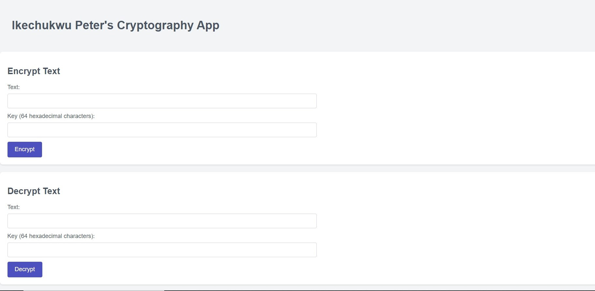
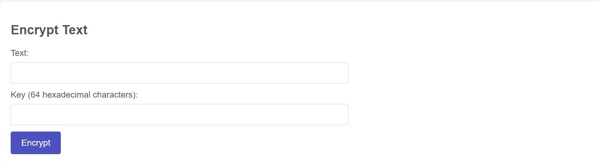
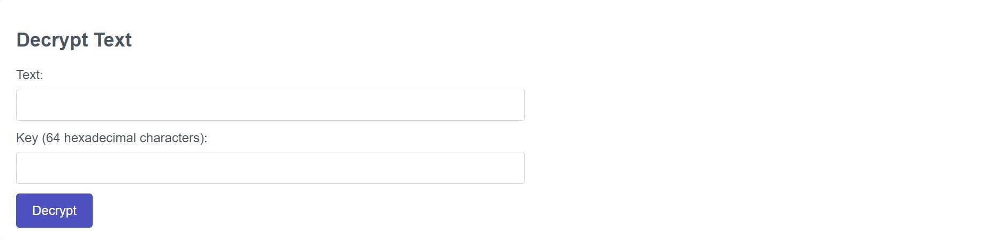
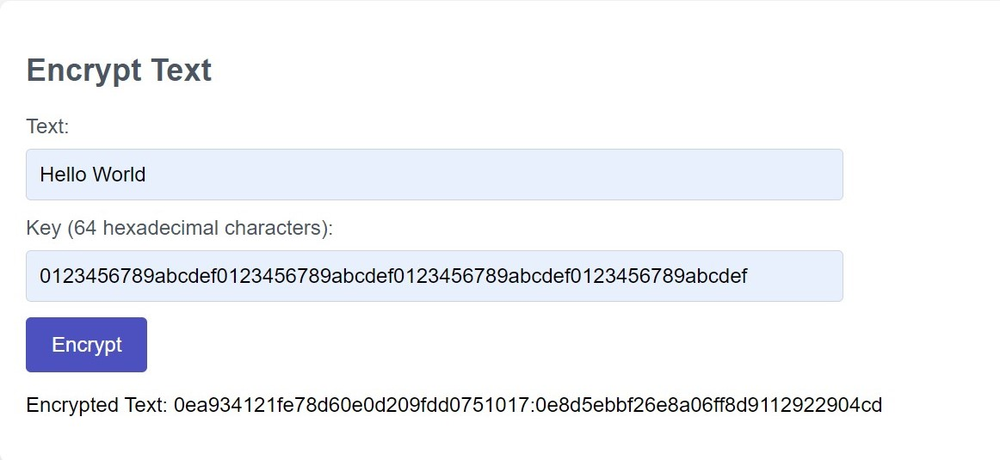
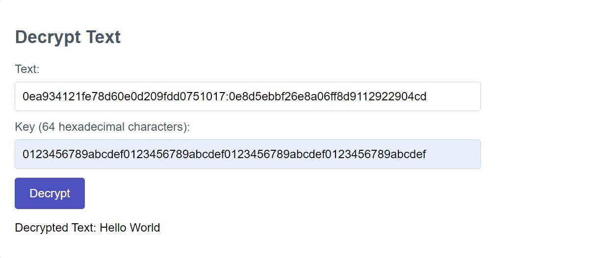

# Ikechukwu Peter's Cryptography App

## Description

A project to demonstrate cryptography







## Table of Contents

- [Ikechukwu Peter's Cryptography App](#ikechukwu-peters-cryptography-app)
  - [Description](#description)
  - [Table of Contents](#table-of-contents)
  - [Built With 🌩️](#built-with-️)
  - [Getting Started ☀️](#getting-started-️)
    - [Prerequisites](#prerequisites)
    - [Setup](#setup)
  - [Installation](#installation)
  - [Configuration](#configuration)
  - [Running the App](#running-the-app)
  - [Testing](#testing)
  - [Usage](#usage)
  - [API Endpoints](#api-endpoints)
  - [Author](#author)
  - [📝 License](#-license)

## Built With 🌩️

- NodeJs
- ExpressJs
- EJS (template engine)
- CSS
- JavaScript
- TypeScript

## Getting Started ☀️

To get a local copy up and running, follow these simple example steps.

### Prerequisites

You'll need Node.js and npm installed on your system. You can install them by running the following command:

You will also need to install nvm, here is an article to install nvm on ubuntu https://www.digitalocean.com/community/tutorials/how-to-install-node-js-on-ubuntu-22-04

### Setup

Clone this repository by typing the following command on your terminal:

```
git clone https://github.com/ikechukwu-peter/cryptography.git
```

## Installation

After cloning the repository, navigate to the project directory and run the following command to install the project dependencies:

```
nvm use
```

```
npm install
```

## Configuration

You'll need to set the following environment variables in a .env file:

```

PORT=<your-port>

```

The `PORT` is the port that the application will run on.

## Running the App

To start the application, run the following command:

```
npm run start

```

This will start the application in production mode.

To run the application in development mode, use the following command:

```
yarn run dev
```

This will start the application in watch mode, so any changes you make to the code will be automatically detected and the application will be recompiled.

## Testing

To run the unit tests, use the following command:

```
npm run test
```

## Usage

To use this project, follow these steps:

1. Open your terminal and run `npm run dev` to start a developement server
2. Go to any API testing tool of your choice, the server should be running in `localhost:<port>` where `port` is supplied by you.
   Look below to understand the endpoints.

## API Endpoints

The following API endpoints are available:

- `POST /encrypt`: Encrypt a text
- `POST /decrypt`: Decrypt a text
- `GET /`: The index page

## Author

👤 **Ikechukwu Peter**

- GitHub: [@ikechukwu-peter](https://github.com/ikechukwu-peter)
- Twitter: [@pete_iyke](https://twitter.com/pete_iyke)
- LinkedIn: [LinkedIn](https://www.linkedin.com/in/peter-ikechukwu/)

## 📝 License

This project is [MIT](./LICENSE) licensed.
